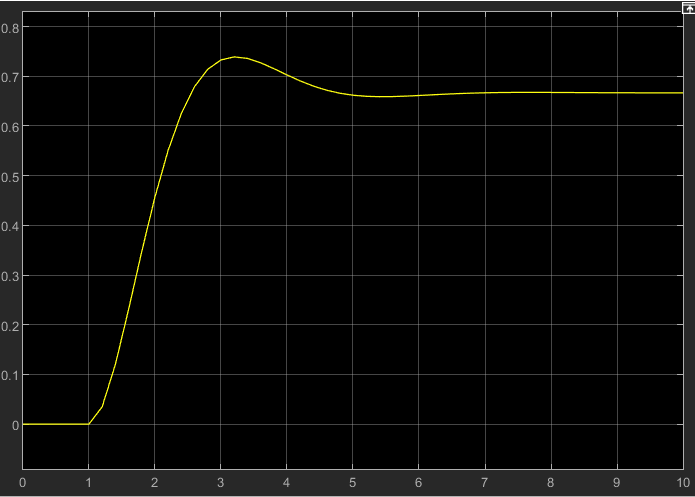
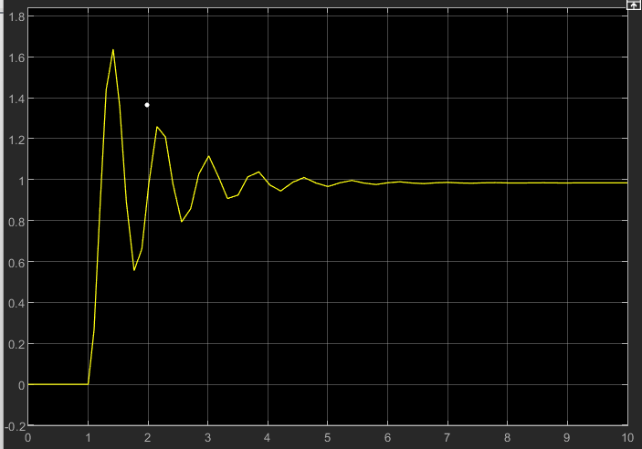
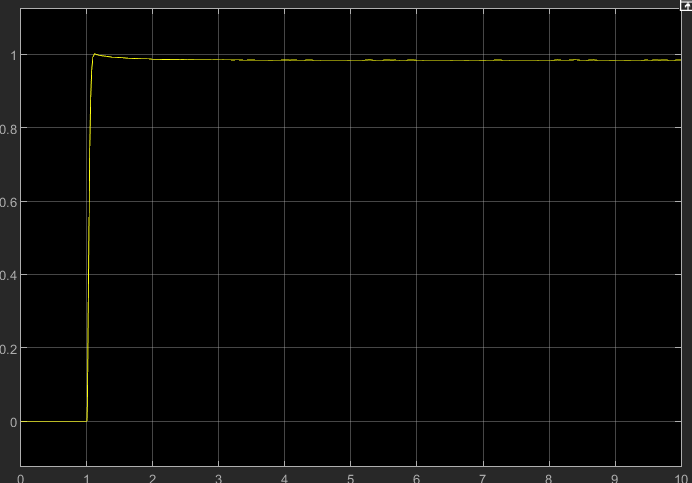
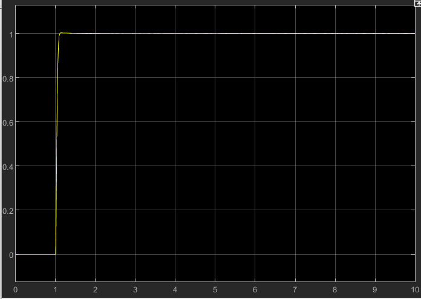
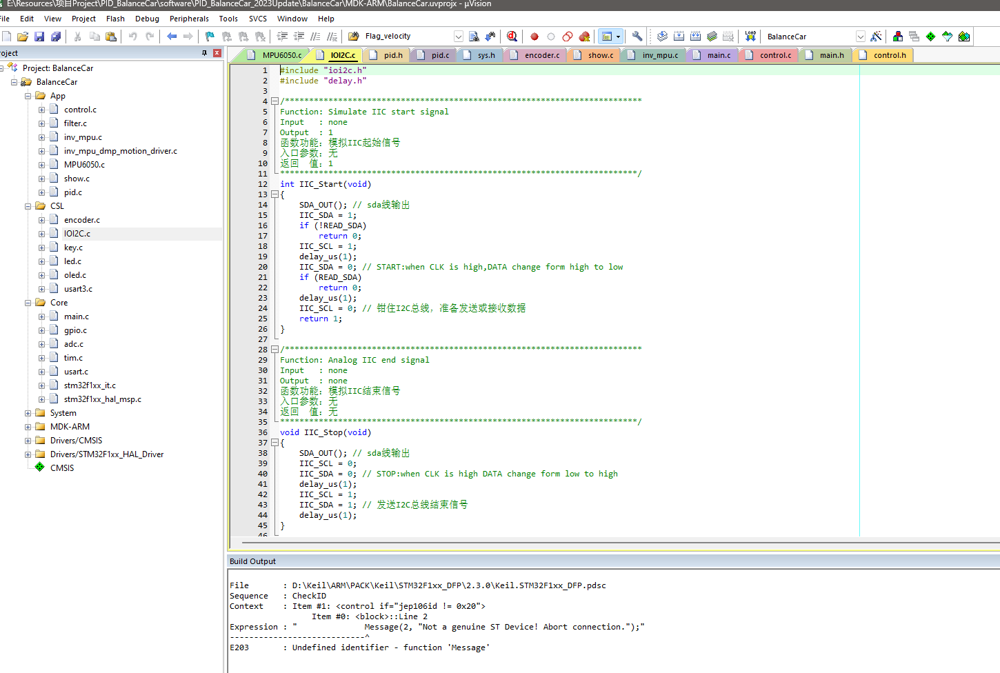
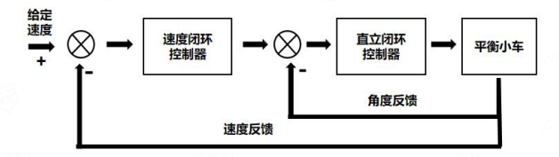

# 基于PID算法的自平衡小车

## 1、Hardware

为了实现小车功能，小车硬件主要包括：

- 控制核心板
- 带编码器的直流电机
- 车架
- 12V 1900mah锂电池

控制核心板主要由STM32F103C8T6作为主控，辅以MPU6050、TB6612电机驱动、12To5V降压模块

0.96寸OLED显示屏等组成，PCB图如下：


电路设计开源在Hardware文件夹中

## 2、Simulink

本项目中使用Matlab的Simulink对PID算法以及卡尔曼滤波进行仿真调试，Simulink文件开源在Simulink文件夹中。

### PID算法仿真

PID算法的Simulink仿真如下：


调试过程如下:

1. 加入Kp = 2比例控制；



2. 增大Kp至62；



3. 出现震荡之后，加入微分参数Kd = 30；



4. 最后加入积分参数Ki = 30；



### 卡尔曼滤波仿真

卡尔曼滤波Simulink仿真如下：


详细调试过程不赘述，这里直接给出效果图：


## 3、Software

对于软件中，使用GPIO模拟I2C驱动MPU6050陀螺仪



这样可以通过封装好的I2C函数读取MPU6050传感器的数据，具体代码如下：

````c
void Get_Angle(void)
{
    float Accel_Y, Accel_Z, Accel_X, Accel_Angle_x, Accel_Angle_y, Gyro_X, Gyro_Z, Gyro_Y;

    Gyro_X = (I2C_ReadOneByte(devAddr, MPU6050_RA_GYRO_XOUT_H) << 8) 
        	+ I2C_ReadOneByte(devAddr, MPU6050_RA_GYRO_XOUT_L);    // 读取X轴陀螺仪
    Gyro_Y = (I2C_ReadOneByte(devAddr, MPU6050_RA_GYRO_YOUT_H) << 8) 
        	+ I2C_ReadOneByte(devAddr, MPU6050_RA_GYRO_YOUT_L);    // 读取Y轴陀螺仪
    Gyro_Z = (I2C_ReadOneByte(devAddr, MPU6050_RA_GYRO_ZOUT_H) << 8) 
        	+ I2C_ReadOneByte(devAddr, MPU6050_RA_GYRO_ZOUT_L);    // 读取Z轴陀螺仪
    Accel_X = (I2C_ReadOneByte(devAddr, MPU6050_RA_ACCEL_XOUT_H) << 8) 
        	+ I2C_ReadOneByte(devAddr, MPU6050_RA_ACCEL_XOUT_L); // 读取X轴加速度计
    Accel_Y = (I2C_ReadOneByte(devAddr, MPU6050_RA_ACCEL_YOUT_H) << 8) 
        	+ I2C_ReadOneByte(devAddr, MPU6050_RA_ACCEL_YOUT_L); // 读取X轴加速度计
    Accel_Z = (I2C_ReadOneByte(devAddr, MPU6050_RA_ACCEL_ZOUT_H) << 8) 
        	+ I2C_ReadOneByte(devAddr, MPU6050_RA_ACCEL_ZOUT_L); // 读取Z轴加速度计
    if (Gyro_X > 32768)
        Gyro_X -= 65536; // 数据类型转换  也可通过short强制类型转换
    if (Gyro_Y > 32768)
        Gyro_Y -= 65536; // 数据类型转换  也可通过short强制类型转换
    if (Gyro_Z > 32768)
        Gyro_Z -= 65536; // 数据类型转换
    if (Accel_X > 32768)
        Accel_X -= 65536; // 数据类型转换
    if (Accel_Y > 32768)
        Accel_Y -= 65536; // 数据类型转换
    if (Accel_Z > 32768)
        Accel_Z -= 65536;                               // 数据类型转换
    BalanceCar.Gyro_Balance = -Gyro_X;                             // 更新平衡角速度
    Accel_Angle_x = atan2(Accel_Y, Accel_Z) * 180 / PI; // 计算倾角，转换单位为度
    Accel_Angle_y = atan2(Accel_X, Accel_Z) * 180 / PI; // 计算倾角，转换单位为度
    Gyro_X = Gyro_X / 16.4;                             // 陀螺仪量程转换，量程±2000°/s对应灵敏度16.4，可查手册
    Gyro_Y = Gyro_Y / 16.4;                             // 陀螺仪量程转换
    Pitch = -Kalman_Filter_x(Accel_Angle_x, Gyro_X); // 卡尔曼滤波
    Roll = -Kalman_Filter_y(Accel_Angle_y, Gyro_Y);
    BalanceCar.Angle_Balance = Pitch;    // 更新平衡倾角
    BalanceCar.Gyro_Turn = Gyro_Z;       // 更新转向角速度
    BalanceCar.Acceleration_Z = Accel_Z; // 更新Z轴加速度计
}
````

系统中的控制时间片由MPU6050模块的INT引脚提供，具体原理为INT引脚每5ms触发一次MCU的外部中断，在外部中断服务函数之中运行所有的控制代码。外部中断服务函数代码如下：

````c
int HAL_GPIO_EXTI_Callback(uint16_t GPIO_Pin)
{
    static int Voltage_Temp, Voltage_Count, Voltage_All; // 电压测量相关变量
    static u8 Flag_Target;                               // 控制函数相关变量，提供10ms基准
    int Encoder_Left, Encoder_Right;                     // 左右编码器的脉冲计数
    int Balance_Pwm, Velocity_Pwm, Turn_Pwm;             // 平衡环PWM变量，速度环PWM变量，转向环PWM变
    if (GPIO_Pin == MPU6050_EXTI_Pin)
    {
        Flag_Target = !Flag_Target;
        Get_Angle();             // 更新姿态，5ms一次，更高的采样频率可以改善卡尔曼滤波和互补滤波的效果
        Encoder_Left = -Read_Encoder(2);  // 读取左轮编码器的值，前进为正，后退为负
        Encoder_Right = -Read_Encoder(4); // 读取右轮编码器的值，前进为正，后退为负
                                          // 左轮A相接TIM2_CH1,右轮A相接TIM4_CH2,故这里两个编码器的极性相同
        Get_Velocity_Form_Encoder(Encoder_Left, Encoder_Right); // 编码器读数转速度（mm/s）

        if (Flag_Target == 1) // 10ms控制一次
        {
            Voltage_Temp = Get_battery_volt(); // 读取电池电压
            Voltage_Count++;                   // 平均值计数器
            Voltage_All += Voltage_Temp;       // 多次采样累积
            if (Voltage_Count == 100){
                BalanceCar.Voltage = Voltage_All / 100;
                Voltage_All = 0;
                Voltage_Count = 0; // 求平均值
            }
            return 0;
        }               // 10ms控制一次
        Read_Distane(); // 获取超声波测量距离值
        if (BalanceCar.Flag_follow == 0 && BalanceCar.Flag_avoid == 0)
            Led_Flash(100); // LED闪烁;常规模式 1s改变一次指示灯的状态
        if (BalanceCar.Flag_follow == 1 || BalanceCar.Flag_avoid == 1)
            Led_Flash(0);                                     // LED常亮;超声波跟随/避障模式
        Key();                                                // 扫描按键状态 单击双击可以改变小车运行状态
        Balance_Pwm = Balance(BalanceCar.Angle_Balance, BalanceCar.Gyro_Balance);   // 平衡PID控制 BalanceCar.Gyro_Balance平衡角速度极性：前倾为正，后倾为负
        Velocity_Pwm = Velocity(Encoder_Left, Encoder_Right); // 速度环PID控制	记住，速度反馈是正反馈，就是小车快的时候要慢下来就需要再跑快一点
        Turn_Pwm = Turn(BalanceCar.Gyro_Turn);                           // 转向环PID控制

        BalanceCar.Motor_Left = Balance_Pwm + Velocity_Pwm + Turn_Pwm;  // 计算左轮电机最终PWM
        BalanceCar.Motor_Right = Balance_Pwm + Velocity_Pwm - Turn_Pwm; // 计算右轮电机最终PWM
                                                             // PWM值正数使小车前进，负数使小车后退
        BalanceCar.Motor_Left = PWM_Limit(BalanceCar.Motor_Left, 6900, -6900);
        BalanceCar.Motor_Right = PWM_Limit(BalanceCar.Motor_Right, 6900, -6900);                       // PWM限幅
        if (Pick_Up(BalanceCar.Acceleration_Z, BalanceCar.Angle_Balance, Encoder_Left, Encoder_Right)) // 检查是否小车被拿起
            BalanceCar.Flag_Stop = 1;                                                       // 如果被拿起就关闭电机
        if (Put_Down(BalanceCar.Angle_Balance, Encoder_Left, Encoder_Right))                // 检查是否小车被放下
            BalanceCar.Flag_Stop = 0;                                                       // 如果被放下就启动电机
        Choose(Encoder_Left, Encoder_Right);                                     // 转动右轮选择小车模式
        if (Turn_Off(BalanceCar.Angle_Balance, BalanceCar.Voltage) == 0)                               // 如果不存在异常
            Set_Pwm(BalanceCar.Motor_Left, BalanceCar.Motor_Right);                                    // 赋值给PWM寄存器
    }
    return 0;
}
````

### PID算法概念

​		PID算法是工业应用中最广泛算法之一，在闭环系统的控制中，可自动对控制系统进行准确且迅速的校正。PID算法已经有100多年历史，在四轴飞行器，平衡小车、汽车定速巡航、温度控制器等场景均有应用。

​		PID算法数学公式如下所示：
$$
u(t) = K_pe(t) + K_i\int^t_0e(t)dt + K_d\frac{de(t)}{dt}
$$
​		该公式适用于连续的模拟量信号，然而本系统中使用的传感器数据为离散的数字量信号，故而需要对公式进行离散化处理，使用一阶差分代替一阶微分、使用累加代 替积分，离散化之后的公式如下：
$$
u(t) = K_pe(t) + K_i\sum(t) + K_d[e(t) - e(t-1)]
$$

### 双环控制PID算法

​		在比较复杂的系统之中，普通的PID算法可能不能满足系统的需求，在工业控制中，对于复杂的系统，常见的方法是使用多环控制的PID算法。针对基于PID的智能自平衡小车，最常见的方法就是使用双环控制的PID算法。

​		在智能自平衡车的双环控制PID算法中，包含直立环和速度环可实现小车在原地保持平衡状态，若小车需要转向，也可以再加入转向环，本文主要详细讲述直立环和速度环的双环控制。

​		直立环使用PD控制，用于控制小车保持直立状态。直立环的入口参数为小车当前的倾斜角度`Angle`与X轴角速度 `Gyro_X`（即为角度的微分），具体的算法实现为：计算出小车当前角度与平衡角度的偏差`Angle_bias`带入PD控制公式：
$$
u(t)=K_pe(t)+K_d[e(t)-e(t-1)]
$$
可以得到直立环的PWM输出值为：
$$
BalancePWM = BalanceK_p\times AngleBias + BalanceK_d\times GyroX
$$
其中`BalancePWM`为直立环比例增益；`BalanceKd`为直立环微分增益；

直立环代码如下：

````c
int Balance(float Angle, float Gyro)
{
    float Angle_bias, Gyro_bias;
    int balance;
    Angle_bias = Middle_angle - Angle; // 求出平衡的角度中值 和机械相关
    Gyro_bias = 0 - Gyro;
    balance = -PID.Balance_Kp / 100 * Angle_bias - Gyro_bias * PID.Balance_Kd / 100; // 计算平衡控制的电机PWM
    return balance;
}

````


​		速度环使用PI控制，用于控制小车的速度。速度环入口参数为小车左右电机的转 速。在平衡模式下，小车的理想状态是保持直立，并且尽量保持在原地不动，故此时 小车的目标速度为0。同时为了减小速度环对直立环的干扰，速度环的速度变化应该缓 慢且平和，故而在速度环中使用一阶低通滤波，减缓速度的变化。一阶低通滤波公式如下：
$$
y(n)=Kx(n)+(1-K)y(n-1)
$$
​		与直立环类似，速度环也需要先求出当前的速度偏差量`Speed_bias` ，经过一阶低通滤波之后，带入PI控制公式：
$$
u(t)=K_pe(t)+K_i \sum e(t)
$$
可以得到速度环的PWM输出值为：
$$
VelocityPWM = VelocityK_p \times VelocityBias + VelocityK_i \times \sum VelocityBias
$$
速度环代码如下：

````c
int Velocity(int encoder_left, int encoder_right)
{
    Encoder_Least = 0 - (encoder_left + encoder_right); 
    Encoder_bias *= 0.86;                 // 一阶低通滤波器
    Encoder_bias += Encoder_Least * 0.14; // 一阶低通滤波器，减缓速度变化
    Encoder_Integral += Encoder_bias;     // 积分出位移 积分时间：10ms
    Encoder_Integral = Encoder_Integral + Movement;// 接收遥控器数据，控制前进后退
    if (Encoder_Integral > 10000)
        Encoder_Integral = 10000; // 积分限幅
    if (Encoder_Integral < -10000)
        Encoder_Integral = -10000;                                                               // 积分限幅
    velocity = -Encoder_bias * PID.Velocity_Kp / 100 - Encoder_Integral * PID.Velocity_Ki / 100; // 速度控制
    if (Turn_Off(BalanceCar.Angle_Balance, BalanceCar.Voltage) == 1 || BalanceCar.Flag_Stop == 1)
        Encoder_Integral = 0; // 电机关闭后清除积分
    return velocity;
}
````

​		

如果小车出现倾角，在直立控制的作用下就会使小车在倾斜的方向加速，我们可以利用小车的这个特性来进行速度控制。**控制速度实际上就变成了控制小车的倾角。**

​		车轮的速度可以通过读取编码器数值来获得。小车的速度控制对快速性要求并不高，但是对于准确性有一定的要求。PID 控制中微分(Didderential)控制 主要的作用是减少振荡，加快稳定速度，积分(Intergral)控制主要的作用是减少静态误差，所以我们可以建立速度 PI 闭环控制。

​		

​		输出一个角度使小车达到目标速度，这就是串级PID控制，**让速度环的输出作为直立环的输入，角度控制的输出直接作用于电机上。**



​		假如速度环输出为`v`，作为目标角度输出直立环，直立环的输出`a`直接作用于电机，使小车产生一个倾角，那么由如下关系：
$$
a=K_p \times(v - v_1) + K_d \times dv
$$

$$
v_1 = K_p \times e(k)+K_i \times \sum e(k)
$$

​		我们将两个式子合并，可以得到下面公式：
$$
a = K_p \times v + K_d \times dv - K_p[Kp_1 \times e(k) + K_i \sum e(k)]
$$
​		a 为直接输出于小车的 PWM。观察式子可以知道，这个串级 PID 系统实际 上是由一个 PD 控制器和一个 PI 控制器组成，我们可以分拆优化为两个控制环分别叠加到电机 PWM 上。

