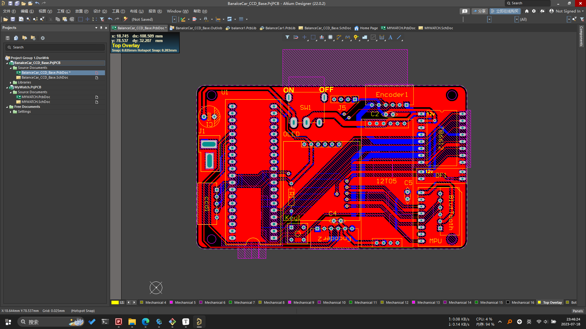
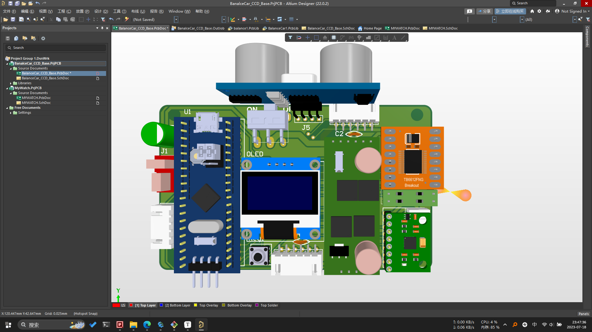
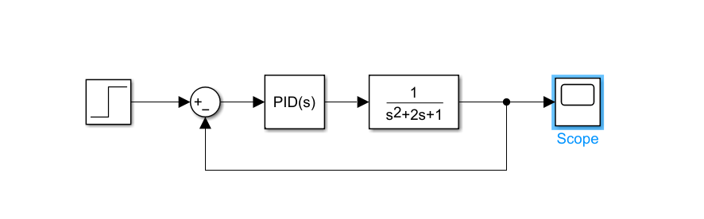
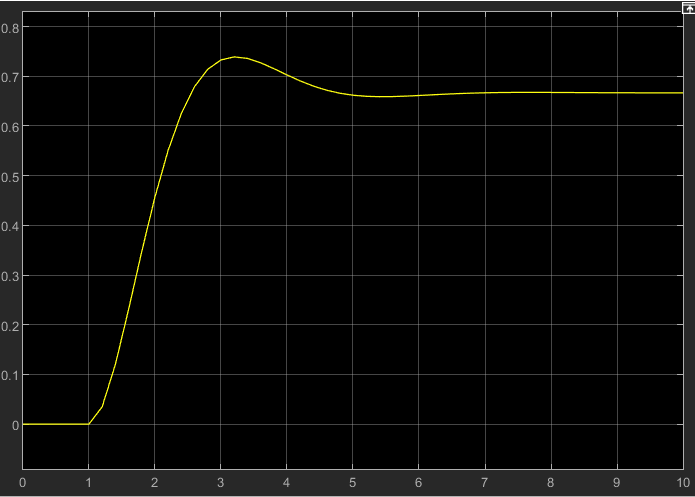
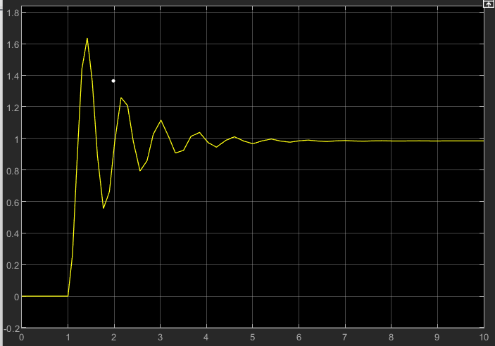
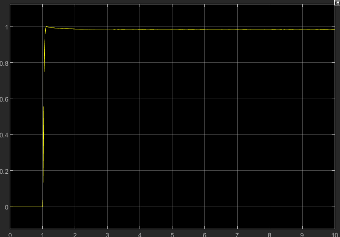
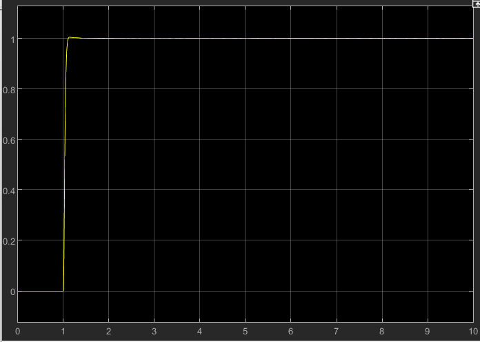
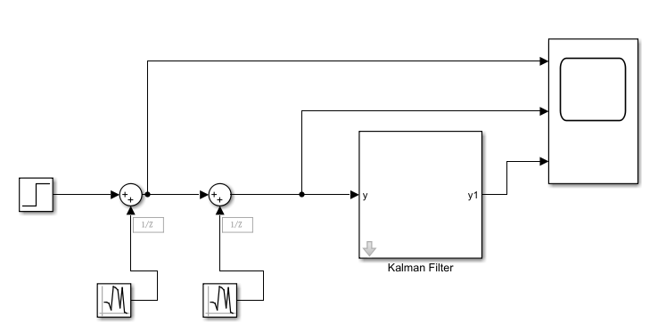
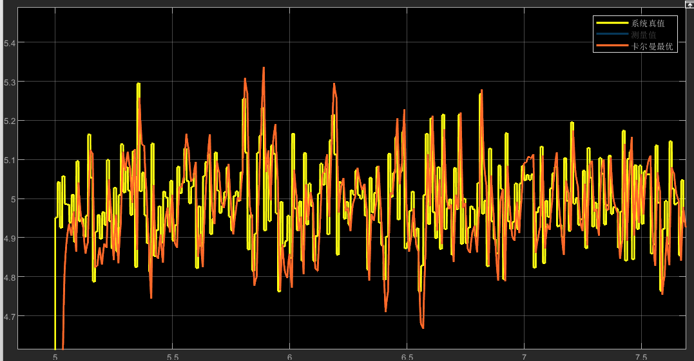

# 基于PID算法的自平衡小车

## 1、Hardware

为了实现小车功能，小车硬件主要包括：

- 控制核心板
- 带编码器的直流电机
- 车架
- 12V 1900mah锂电池

控制核心板主要由STM32F103C8T6作为主控，辅以MPU6050、TB6612电机驱动、12To5V降压模块

0.96寸OLED显示屏等组成，PCB图如下：





电路设计开源在Hardware文件夹中

## 2、Simulink

本项目中使用Matlab的Simulink对PID算法以及卡尔曼滤波进行仿真调试，Simulink文件开源在Simulink文件夹中。

### PID算法仿真

PID算法的Simulink仿真如下：



调试过程如下:

1. 加入Kp = 2比例控制；



2. 增大Kp至62；



3. 出现震荡之后，加入微分参数Kd = 30；



4. 最后加入积分参数Ki = 30；



### 卡尔曼滤波仿真

卡尔曼滤波Simulink仿真如下：



详细调试过程不赘述，这里直接给出效果图：



## 3、Software

对于软件中，使用GPIO模拟I2C驱动MPU6050陀螺仪


这样可以通过封装好的I2C函数读取MPU6050传感器的数据，具体代码如下：

````c
void Get_Angle(void)
{
    float Accel_Y, Accel_Z, Accel_X, Accel_Angle_x, Accel_Angle_y, Gyro_X, Gyro_Z, Gyro_Y;

    Gyro_X = (I2C_ReadOneByte(devAddr, MPU6050_RA_GYRO_XOUT_H) << 8) 
        	+ I2C_ReadOneByte(devAddr, MPU6050_RA_GYRO_XOUT_L);    // 读取X轴陀螺仪
    Gyro_Y = (I2C_ReadOneByte(devAddr, MPU6050_RA_GYRO_YOUT_H) << 8) 
        	+ I2C_ReadOneByte(devAddr, MPU6050_RA_GYRO_YOUT_L);    // 读取Y轴陀螺仪
    Gyro_Z = (I2C_ReadOneByte(devAddr, MPU6050_RA_GYRO_ZOUT_H) << 8) 
        	+ I2C_ReadOneByte(devAddr, MPU6050_RA_GYRO_ZOUT_L);    // 读取Z轴陀螺仪
    Accel_X = (I2C_ReadOneByte(devAddr, MPU6050_RA_ACCEL_XOUT_H) << 8) 
        	+ I2C_ReadOneByte(devAddr, MPU6050_RA_ACCEL_XOUT_L); // 读取X轴加速度计
    Accel_Y = (I2C_ReadOneByte(devAddr, MPU6050_RA_ACCEL_YOUT_H) << 8) 
        	+ I2C_ReadOneByte(devAddr, MPU6050_RA_ACCEL_YOUT_L); // 读取X轴加速度计
    Accel_Z = (I2C_ReadOneByte(devAddr, MPU6050_RA_ACCEL_ZOUT_H) << 8) 
        	+ I2C_ReadOneByte(devAddr, MPU6050_RA_ACCEL_ZOUT_L); // 读取Z轴加速度计
    if (Gyro_X > 32768)
        Gyro_X -= 65536; // 数据类型转换  也可通过short强制类型转换
    if (Gyro_Y > 32768)
        Gyro_Y -= 65536; // 数据类型转换  也可通过short强制类型转换
    if (Gyro_Z > 32768)
        Gyro_Z -= 65536; // 数据类型转换
    if (Accel_X > 32768)
        Accel_X -= 65536; // 数据类型转换
    if (Accel_Y > 32768)
        Accel_Y -= 65536; // 数据类型转换
    if (Accel_Z > 32768)
        Accel_Z -= 65536;                               // 数据类型转换
    BalanceCar.Gyro_Balance = -Gyro_X;                             // 更新平衡角速度
    Accel_Angle_x = atan2(Accel_Y, Accel_Z) * 180 / PI; // 计算倾角，转换单位为度
    Accel_Angle_y = atan2(Accel_X, Accel_Z) * 180 / PI; // 计算倾角，转换单位为度
    Gyro_X = Gyro_X / 16.4;                             // 陀螺仪量程转换，量程±2000°/s对应灵敏度16.4，可查手册
    Gyro_Y = Gyro_Y / 16.4;                             // 陀螺仪量程转换
    Pitch = -Kalman_Filter_x(Accel_Angle_x, Gyro_X); // 卡尔曼滤波
    Roll = -Kalman_Filter_y(Accel_Angle_y, Gyro_Y);
    BalanceCar.Angle_Balance = Pitch;    // 更新平衡倾角
    BalanceCar.Gyro_Turn = Gyro_Z;       // 更新转向角速度
    BalanceCar.Acceleration_Z = Accel_Z; // 更新Z轴加速度计
}
````

系统中的控制时间片由MPU6050模块的INT引脚提供，具体原理为INT引脚每5ms触发一次MCU的外部中断，在外部中断服务函数之中运行所有的控制代码。外部中断服务函数代码如下：

````c
int HAL_GPIO_EXTI_Callback(uint16_t GPIO_Pin)
{
    static int Voltage_Temp, Voltage_Count, Voltage_All; // 电压测量相关变量
    static u8 Flag_Target;                               // 控制函数相关变量，提供10ms基准
    int Encoder_Left, Encoder_Right;                     // 左右编码器的脉冲计数
    int Balance_Pwm, Velocity_Pwm, Turn_Pwm;             // 平衡环PWM变量，速度环PWM变量，转向环PWM变
    if (GPIO_Pin == MPU6050_EXTI_Pin)
    {
        Flag_Target = !Flag_Target;
        Get_Angle();             // 更新姿态，5ms一次，更高的采样频率可以改善卡尔曼滤波和互补滤波的效果
        Encoder_Left = -Read_Encoder(2);  // 读取左轮编码器的值，前进为正，后退为负
        Encoder_Right = -Read_Encoder(4); // 读取右轮编码器的值，前进为正，后退为负
                                          // 左轮A相接TIM2_CH1,右轮A相接TIM4_CH2,故这里两个编码器的极性相同
        Get_Velocity_Form_Encoder(Encoder_Left, Encoder_Right); // 编码器读数转速度（mm/s）

        if (Flag_Target == 1) // 10ms控制一次
        {
            Voltage_Temp = Get_battery_volt(); // 读取电池电压
            Voltage_Count++;                   // 平均值计数器
            Voltage_All += Voltage_Temp;       // 多次采样累积
            if (Voltage_Count == 100){
                BalanceCar.Voltage = Voltage_All / 100;
                Voltage_All = 0;
                Voltage_Count = 0; // 求平均值
            }
            return 0;
        }               // 10ms控制一次
        Read_Distane(); // 获取超声波测量距离值
        if (BalanceCar.Flag_follow == 0 && BalanceCar.Flag_avoid == 0)
            Led_Flash(100); // LED闪烁;常规模式 1s改变一次指示灯的状态
        if (BalanceCar.Flag_follow == 1 || BalanceCar.Flag_avoid == 1)
            Led_Flash(0);                                     // LED常亮;超声波跟随/避障模式
        Key();                                                // 扫描按键状态 单击双击可以改变小车运行状态
        Balance_Pwm = Balance(BalanceCar.Angle_Balance, BalanceCar.Gyro_Balance);   // 平衡PID控制 BalanceCar.Gyro_Balance平衡角速度极性：前倾为正，后倾为负
        Velocity_Pwm = Velocity(Encoder_Left, Encoder_Right); // 速度环PID控制	记住，速度反馈是正反馈，就是小车快的时候要慢下来就需要再跑快一点
        Turn_Pwm = Turn(BalanceCar.Gyro_Turn);                           // 转向环PID控制

        BalanceCar.Motor_Left = Balance_Pwm + Velocity_Pwm + Turn_Pwm;  // 计算左轮电机最终PWM
        BalanceCar.Motor_Right = Balance_Pwm + Velocity_Pwm - Turn_Pwm; // 计算右轮电机最终PWM
                                                             // PWM值正数使小车前进，负数使小车后退
        BalanceCar.Motor_Left = PWM_Limit(BalanceCar.Motor_Left, 6900, -6900);
        BalanceCar.Motor_Right = PWM_Limit(BalanceCar.Motor_Right, 6900, -6900);                       // PWM限幅
        if (Pick_Up(BalanceCar.Acceleration_Z, BalanceCar.Angle_Balance, Encoder_Left, Encoder_Right)) // 检查是否小车被拿起
            BalanceCar.Flag_Stop = 1;                                                       // 如果被拿起就关闭电机
        if (Put_Down(BalanceCar.Angle_Balance, Encoder_Left, Encoder_Right))                // 检查是否小车被放下
            BalanceCar.Flag_Stop = 0;                                                       // 如果被放下就启动电机
        Choose(Encoder_Left, Encoder_Right);                                     // 转动右轮选择小车模式
        if (Turn_Off(BalanceCar.Angle_Balance, BalanceCar.Voltage) == 0)                               // 如果不存在异常
            Set_Pwm(BalanceCar.Motor_Left, BalanceCar.Motor_Right);                                    // 赋值给PWM寄存器
    }
    return 0;
}
````

